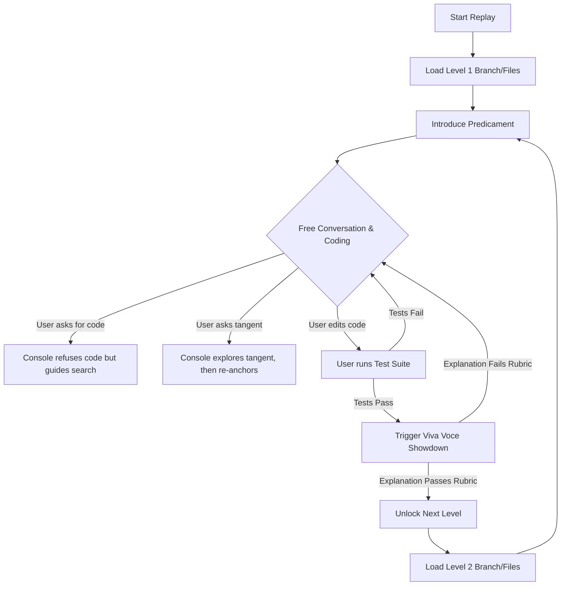

# The Replay Specification (v1.0)
*Structure the Situation, Not the Speech.*

A **Replay** is a packaged cognitive environment designed to be loaded into a Large Language Model (the **Console**). The Replay does not script the conversation; instead, it defines the environment (the playground), the sequence of predicaments (the level design), and the showdowns (the evaluation gates). The learner supplies the verb (the conversation and code).

---

## 1. Directory Structure

A standard `.replay` bundle is structured as follows:

```text
my-browser-replay/
├── CLAUDE.md               # Bootloader defining metadata, environment state, and spine rules
├── replay.py               # Local companion CLI runner
├── .game/                  # Game State Directory (Git-ignored if hosted, committed for local save)
│   ├── progress.json       # Machine-readable progress save slot
│   └── journal.md          # Narrative learning log containing tutor notes
├── browser_engine/         # The Sandboxed Workspace / Codebase
│   ├── src/                # The codebase containing the seeded predicaments
│   └── tests/              # Automated test suites for each showdown
├── journey/                # The Predicament Spine
│   ├── 01_css_specificity.md
│   └── 02_dom_parser.md
├── context/                # Grounding Reference Materials
│   └── blink_architecture_spec.md
└── evaluation/             # Showdown Examiners
    └── viva_voces/         # Rubrics for oral/conceptual examinations
```

---

## 2. Core Manifest: `.game/progress.json`

The manifest governs the state machine of the Replay, defining how the environment changes and how progress is gated.

```json
{
  "active_level": 1,
  "completed_levels": [],
  "calibration": {
    "c_experience": null,
    "kernel_experience": null
  },
  "learning_journal": {
    "concepts_mastered": [],
    "misconceptions_identified": []
  }
}
```

---

## 3. The Five Ingredients Spec

### A. Context (Grounding)
*   **The Artifact:** Instead of letting the Console hallucinate engine behaviors, the Replay mounts a concrete codebase (e.g., a lightweight layout engine, or a subset of Blink source files).
*   **Constraint:** The Console's system instructions restrict it to speaking only about the mounted files, the architecture specs provided in `/context`, and the immediate compile/test failures of the workspace.
*   **Effect:** The conversation changes from *hypothetical* ("How do layout engines work?") to *indexical* ("Why does line 143 of `css_resolver.py` execute before line 192?").

### B. Persona & Pedagogy (Instructional Engine)
The Socratic engine is defined in the global runtime prompt loaded by the Console (`CLAUDE.md`). Rather than locking down the tone, it enforces strict boundaries on *information disclosure* and *cognitive load*:

1.  **Prediction First:** If the user asks "What happens if I change X?", the Console must refuse to answer until the user predicts the outcome: *"What do you think the rendering pipeline will do when it hits that instruction? Make a guess, and I will simulate it for you."*
2.  **No Direct Solutions:** The Console is strictly barred from writing code fixes for the student. It can point to an area of code, show code snippets of related patterns, or explain compiler error syntax, but it must never write the patch.
3.  **Encourage Rabbit Holes:** If a student asks a tangent (e.g., "Wait, how does the hardware GPU do the draw calls?"), the Console should dive deep. Tangents are the medium working as intended. However, the Console must maintain a visual or text pointer back to the "active predicament" to anchor the session.

### C. Sequence (The Path of Predicaments)
*   **Concept:** A sequence is not a sequence of chapters. It is a sequence of **predicaments** (problem-states) seeded in the codebase.
*   **The Level Design:** Each stage in the manifest checks out a specific git branch or applies a patch to the codebase. The environment is deliberately broken in a precise way:
    *   *Stage 1:* The CSS style resolver works, but it lacks specificity calculations, causing classes to override ID styles.
    *   *Stage 2:* The HTML parser crashes on nested tags due to incorrect stack logic.
*   **Load Control:** The sequence ensures that resolving the active predicament requires exactly **one** new concept (e.g. specificity weight) plus concepts previously mastered.

### D. Tools (The Lab Sandbox)
*   **Feedback Loop:** The student must have a terminal, a compiler/interpreter, and a test harness.
*   **Indexical Errors:** The student makes changes to the code, runs the test command (e.g., `python replay.py checkpoint`), and compiles. The compiler output and test results are the objective referee. 
*   **The Console's Role:** The Console acts as a co-debugger, parsing compiler errors and test failures, helping the student read tracebacks, but refusing to touch the keyboard.

### E. Evaluation (The Showdown Gates)
To progress to the next predicament, the student must pass a two-part Showdown:

1.  **The Mechanical Showdown:** The test suite (`test_command`) must compile and pass cleanly. There is no negotiating with the test suite.
2.  **The Viva Voce (Conceptual Showdown):** Once the tests pass, the Console switches from collaborator to examiner. It loads the `showdown_rubric.md` and conducts a brief oral examination:
    *   *"Your specificity calculations pass the tests. But tell me: in Blink, how is specificity packed into a 32-bit integer? What happens if you exceed 255 classes? Walk me through the trade-offs. No notes."*
    *   The Console evaluates the explanation against the rubric. Only when both the mechanical and conceptual tests are satisfied does the manifest unlock the branch or file decryption for the next predicament.

---

## 4. The Console Runtime Loop

When the Replay is initialized, the Console runs the following loop:


